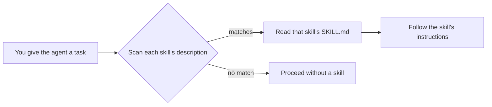

# Repository Skills

[](https://github.com/pjmgomez/repository-skills/actions/workflows/validate-skills.yml)
[](LICENSE)

A curated collection of self-contained **agent skills**. Each skill is a reusable capability that any
AI coding agent supporting the `SKILL.md` convention can load to carry out a specialized task.

## What it does

Each skill lives in its own folder under [.github/skills/](.github/skills) and is a single
`SKILL.md` — YAML frontmatter plus Markdown instructions — optionally accompanied by helper scripts,
on-demand references, and assets:

```
.github/skills/<name>/
├── SKILL.md        # required: YAML frontmatter + Markdown instructions
├── LICENSE.txt     # required: per-skill license
├── scripts/        # optional: executable helpers
├── references/     # optional: docs loaded on demand
└── assets/         # optional: templates and other files used in output
```

An agent reads the frontmatter `description` of every available skill and loads one only when that
description matches the task at hand. Because each skill is self-contained, it can be used here or
copied into another repository unchanged. See [AGENTS.md](AGENTS.md) for the full anatomy, conventions,
and authoring rules.

## Available skills

| Skill | What it does |
| --- | --- |
| [github-repo-setup](.github/skills/github-repo-setup/SKILL.md) | Scaffold and audit a repository's folder structure and community-health files (README, CONTRIBUTING, SECURITY, issue and PR templates, `.gitignore`). |
| [readme-authoring](.github/skills/readme-authoring/SKILL.md) | Author or improve a repository's README so it clearly explains what a project does, why it is useful, and how to use it. |

Each skill ships with its own evaluation workspace (`<name>-workspace/`) that A/B-tests it with and
without the skill applied.

## Getting started

### Prerequisites

- An AI coding agent that supports the `SKILL.md` skill convention.
- [git](https://git-scm.com/) to clone the repository.

### Get the skills

Clone the repository so your agent can discover the skills under [.github/skills/](.github/skills):

```
git clone https://github.com/pjmgomez/repository-skills.git
```

To use a single skill in another project, copy its folder into that repository's `.github/skills/`
directory — no other files are required.

## Usage

You do not run these skills directly; an agent loads them for you. When you give an agent a task, it
scans each skill's frontmatter `description` and, if one matches, reads that skill's `SKILL.md` and
follows its instructions.



For example, asking an agent to "write a README for this project" matches the
[readme-authoring](.github/skills/readme-authoring/SKILL.md) skill, whose description triggers on
exactly that request. To see what a skill does and when it activates, open its `SKILL.md` and read the
`description` field. [AGENTS.md](AGENTS.md) explains how this discovery works in more detail.

## Contributing

Contributions — new skills or improvements to existing ones — are welcome. Start with
[AGENTS.md](AGENTS.md), which documents the skill anatomy, the `SKILL.md` frontmatter rules, and how to
validate and package a skill. The helper prompts in [.github/prompts/](.github/prompts) scaffold and
review skills, and every skill is checked in CI by
[.github/workflows/validate-skills.yml](.github/workflows/validate-skills.yml). Each skill carries its
own `LICENSE.txt`; keep it when adding or copying a skill.

## Getting help

Have a question or found a problem? [Open an issue](https://github.com/pjmgomez/repository-skills/issues)
or [start a discussion](https://github.com/pjmgomez/repository-skills/discussions) on the repository's
GitHub page.

## Maintainers

Maintained by [@pjmgomez](https://github.com/pjmgomez) together with the project's
[contributors](https://github.com/pjmgomez/repository-skills/graphs/contributors). The best way to
reach the maintainers is by [opening an issue](https://github.com/pjmgomez/repository-skills/issues)
or [starting a discussion](https://github.com/pjmgomez/repository-skills/discussions).

## License

Released under the Apache License 2.0 — see [LICENSE](LICENSE) for the full text.
